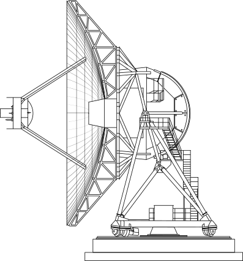

# VLBA Antenna Graphic

<picture>
  <source media="(prefers-color-scheme: dark)" srcset="./vlba_dark.png">
  
</picture>

This is a graphic of a VLBA antenna I originally traced from *Fig. 2.1* in [Thompson, A. R., ***"VLBA Technical Report No. 15 (Rev. A), An Introduction to the VLBA recieving and recording system"***, 1993](https://library.nrao.edu/public/memos/vlba/tech/VLBATR_15A.pdf) using Inkscape.
I converted that svg to TeX/TikZ code using [SVG2TikZ](https://github.com/xyz2tex/svg2tikz) and manually fixed the
code at some places.

## Usage
Make sure to use TeXLive 2023 or newer with latexmk and you have make installed. Use `$ make` or
```
$ make <all|build/vlba.pdf>
```
to build the graphic. The pdf can then be found in the `build` directory. Call
```
$ make clean
```
to remove the `build` directory.
